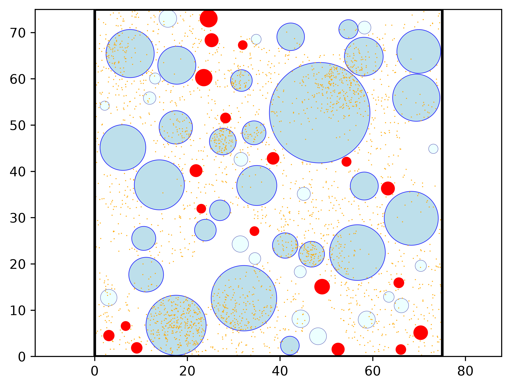
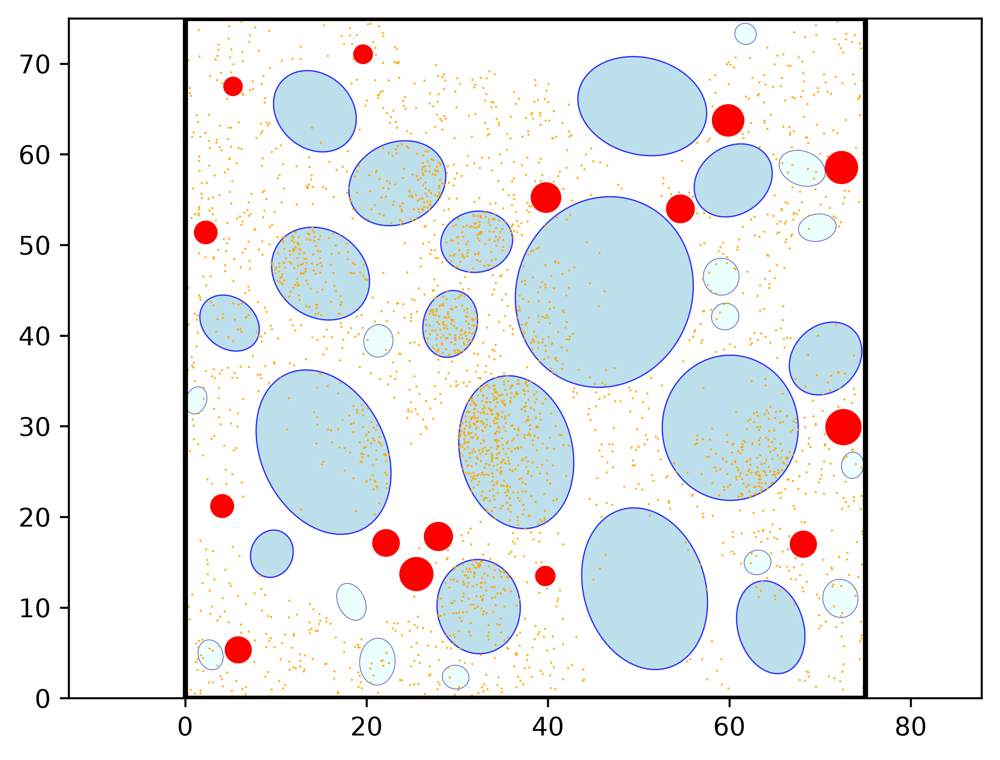
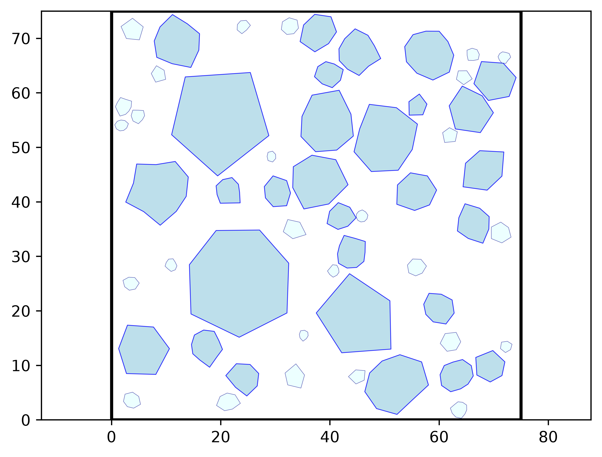

<p align="center">
  
</p>

<h1 align="center">Meso2D</h1>

<p align="center">
  Generate, explore, and export 2D mesostructures of cement-based materials.
  <br>
  Three aggregate morphologies. Reproducible parameters. Geometry ready for downstream tools.
</p>

<p align="center">
  <a href="#installation">Installation</a> ·
  <a href="#quick-start">Quick Start</a> ·
  <a href="#screenshots">Screenshots</a> ·
  <a href="#exports">Exports</a>
</p>

## What is Meso2D?

Meso2D is a Python desktop application for building and visualizing 2D mesoscale models. Choose the aggregate shape — circles, ellipses, or polygons — set the gradation and specimen dimensions, and configure pores and reactive points in the aggregates and paste.

A random seed lets you reproduce a configuration. Generated structures can be saved as images or exported to vector and geometry formats.

## Installation

You need Git and Python. Clone the repository, create a virtual environment, and install the dependencies:

```bash
git clone https://github.com/Serchp/Meso_2D_enconstruccion.git
cd Meso_2D_enconstruccion
python -m venv .venv
```

Activate the virtual environment:

```powershell
# Windows PowerShell
.venv\Scripts\Activate.ps1
```

```bash
# macOS / Linux
source .venv/bin/activate
```

Install the packages and launch the application:

```bash
python -m pip install --upgrade pip
pip install -r requirements.txt
python Meso2d.py
```

## Quick Start

With the dependencies installed, you can generate a first structure in about 30 seconds:

1. Run `python Meso2d.py` and choose **Circles**, **Ellipses**, or **Polygons**.
2. Select **File > Load Example**. The file picker opens `docs/examples`; choose the example for that mode, such as `example_circles.txt`.
3. For a lightweight test, uncheck **Pores** and **Reactive points**.
4. Click **Run** to generate and view the structure.

The examples are stored in `docs/examples`. They include a random seed, and loading one automatically enables the pore and reactive-point options when their parameters are set. Leave them enabled to try a more complete structure; runtime depends on your hardware and selected options. The `.txt` files are project configurations containing JSON data, not geometry exports.

## Screenshots

These output views were generated by Meso2D with the example configuration and pores and reactive points disabled, to highlight the aggregate morphologies.

<table>
  <tr>
    <td align="center"><strong>Circles</strong></td>
    <td align="center"><strong>Ellipses</strong></td>
    <td align="center"><strong>Polygons</strong></td>
  </tr>
  <tr>
    <td></td>
    <td></td>
    <td></td>
  </tr>
</table>

## Exports

After generating a structure, use **File > Save Structure** and choose a format:

- **DXF** (`.dxf`): entities organized into layers for CAD workflows.
- **Gmsh GEO** (`.geo`): geometry to open or mesh with Gmsh.
- **SVG** (`.svg`): scalable vector drawing.
- **JSON** (`.json`): the domain, a summary, and the structure entities.

You can also save the view as an image. JSON exports contain the generated geometry; the example `.txt` files contain parameters for loading a project.

## Documentation

- [Spanish user tutorial](docs/tutorial/Meso2D_user_tutorial.pdf)
- [English user tutorial](docs/tutorial/Meso2D_user_tutorial_EN.pdf)

## License

This project is licensed under the MIT License. See [LICENSE](LICENSE) for the full text.
